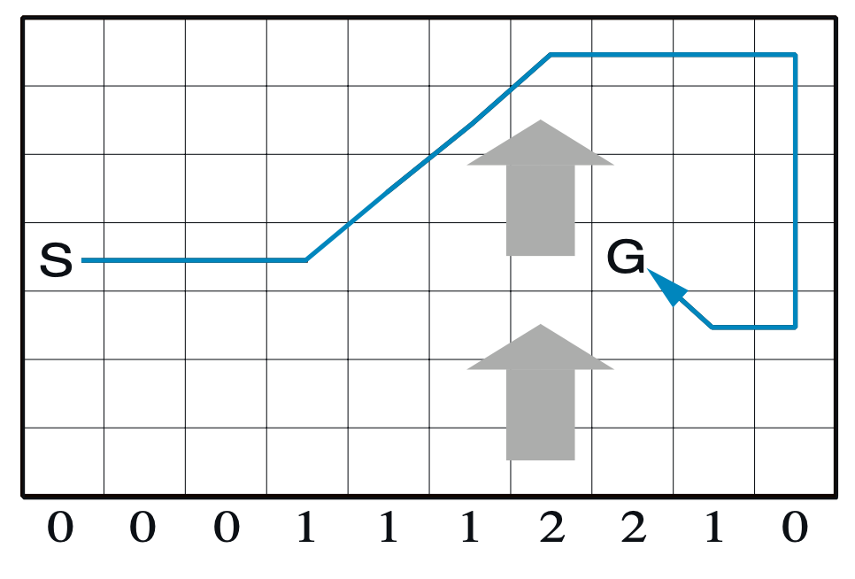
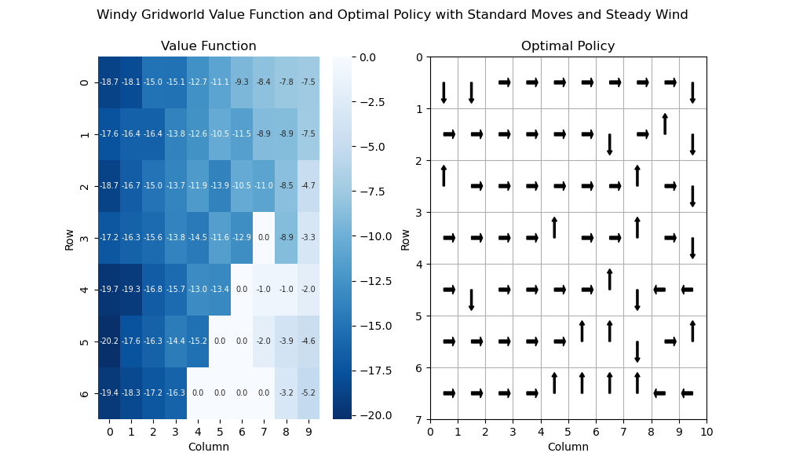
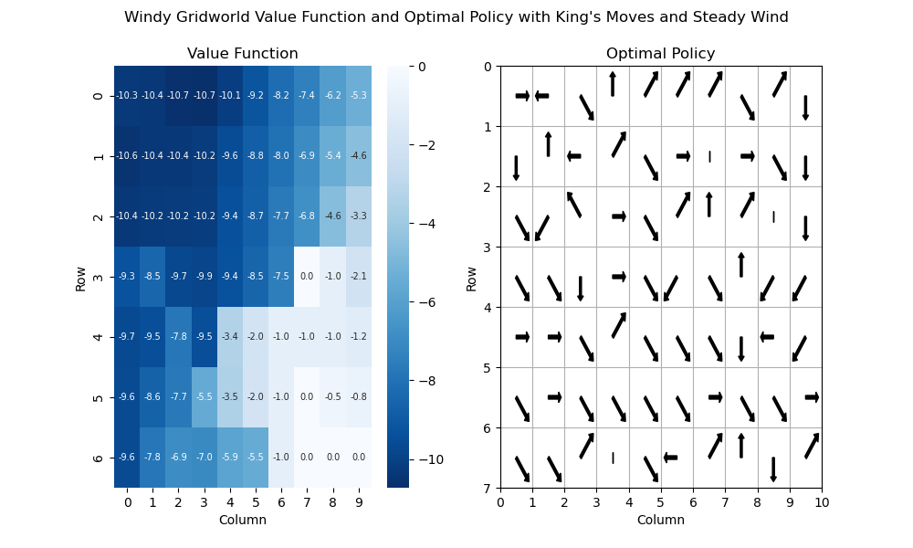
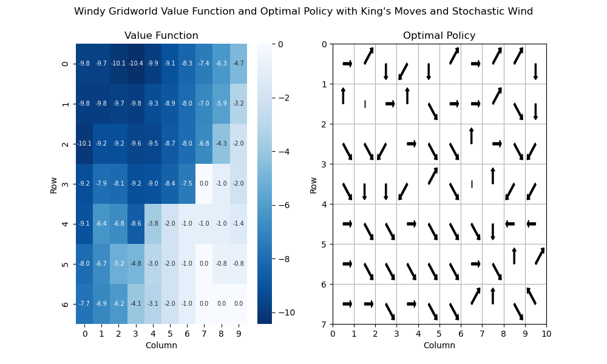

# Problem Definition

Starting with our normal Grid World, we add Start and Goal states. Rewards are -1 on all movements, and the episode terminates when agent reaches the goal state. We are incentivizing the agent to find the shortest path from the Start to the Goal (marked S and G)



The agent starts in the Start state, and to begin with has 4 actions: `{NORTH, EAST, SOUTH, WEST}`. After taking each action, the wind effect is taken into consideration. For example, if the agent picks `EAST`, and there is a Northward wind of strength 1, the next state will be one step north and one step east (assuming that is a valid state). If any action would take the agent off the grid, the agent stays in place. The objective is to reach the goal in as few steps as possible.

In two further iterations of the problem we:

- expand the possible set of action to "King's moves", like in chess but also an option to stay in place: `{NORTH, EAST, SOUTH, WEST, NORTHEAST, SOUTHEAST, SOUTHWEST, NORTHWEST, STAY}`
- make the wind itself stochastic. Instead of the fixed array defined in the problem, we add a +/- 1 random factor.

# How to Run the Notebook

1. In your terminal:

```nasm
docker compose up
```

1. In your web browser, open `localhost:8888` 
2. Enter the token `my-token` 
3. Navigate into the `work/` folder, and open the `windy-gridworld.ipynb` notebook in the JupyterLab environment. 

Link to the Notion blog: [Link](https://harmless-resistance-e28.notion.site/Windy-Gridworld-1434b68d0c408064a8e4f7471c7577e9)


## Formulation as a MDP

- States: (r, c) for each row, col pair in the grid
- Actions: `{NORTH, EAST, SOUTH, WEST}`
- Rewards: constant reward of -1 until goal state is reached

## Sarsa Algorithm

We can solve this problem using the Sarsa temporal-difference learning algorithm, which follows the given equation for updating $Q(s, a)$, the action-value function.

$$
Q_{t+1}(s, a) \leftarrow Q_t(s, a) + \alpha [R_{t+1} + \gamma Q_t(S_{t+1}, A_{t+1}) - Q_t(s, a)]
$$

At each state-action pair $(S_t, A_t)$, we sample the action according to the current $Q$ (usually we follow $\epsilon$-greedy policy), which brings us to the next state-action pair $(S_{t+1}, A_{t+1})$ . We then use the current estimate of this pair to update the previous pair. This is known as a 1-step sample update.

The advantage of this algorithm over Monte Carlo is that we can perform updates while the episode is ongoing, instead of waiting until the end. In Windy Gridworld, if we follow a fixed sub-optimal policy the episode may not terminate at all.

The algorithm is implemented as follows:

```
Params: step size a: (0,1], small e > 0
Initialize Q(s, a) arbitrarily, where Q(terminal, .) = 0

Loop for each episode:
    Initialize S
    Choose A from S using policy derived from Q (e-greedy)
    Loop for each step of episode:
        Take action A, observe R, S'
        Choose A' from S' using policy derived from Q (e-greedy)
        Q(S, A) = Q(S, A) + a[R+gamma*Q(S', A') - Q(S, A)]
        S = S'
        A = A'
    until S is terminal

```

## Results

- Sarsa (e-greedy) learns the optimal policy for each of the three iterations of the problem.
    - With king's moves, it learns to use the wind to help the agent reach the goal. In particular, it learns that the `SOUTHEAST` action can counteract the northward wind and can move the agent directly east.
    - The stochastic wind tends to not have a big impact in the optimal policy, looks like the stochasticisity of the wind cancels itself out.
- The southeast corner of the grid is almost entirely untouched. No updates happen here because in none of the optimal policies does the agent end up in that state.

### Plots of Value Function and Optimal Policy

**Standard moves, Steady Wind:**



From the start state, the value is `-17.2`. The actual optimal path takes 15 moves, but can take longer with e-greedy decision making with `e=0.1`.

**King’s Moves, Steady Wind**



From the start state, the value is `-9.3`. Notice how the path actually dips south before using the wind the bring it back north!

**King’s Moves, Stochastic Wind**



From the start state, the value is `-9.2`. Again, the path dips down before using the wind (on average) to go back up.

## Notes

- The Sarsa learning for especially the standard moves can be fickle. This may be due to the exploration parameter $\epsilon$. But in general I noticed similar optimal policies being converged to, but not one specific one.
- On the other hand, the shorter paths with King's move tend to converge more quickly.
- I tried to do this with OpenAI gym in a docker container, but couldn’t figure out how to get the graphics working with XQuartz, etc.